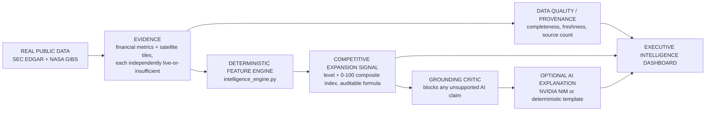
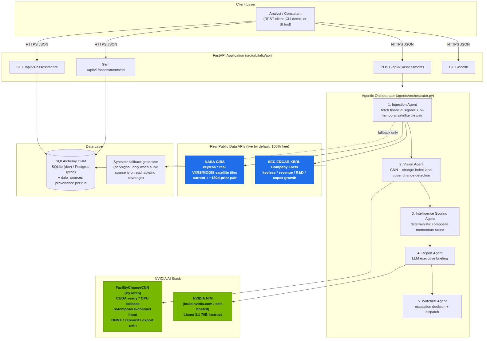

# OrbitalIQ Enterprise — Competitive Expansion Intelligence Platform

**An enterprise-grade Competitive Expansion Intelligence Platform, powered by real financial filings and real satellite imagery — not scraped rumors, not synthetic demo data, and never a number invented to complete a picture.**

> Users enter a company name. OrbitalIQ resolves authoritative company information where available and automatically performs evidence-backed financial and location-aware intelligence. When evidence is unavailable, OrbitalIQ explicitly reports `INSUFFICIENT_DATA` rather than guessing.

OrbitalIQ Enterprise scores how aggressively a public company is expanding a given facility by fusing two genuinely independent evidence sources: audited financial-growth signals pulled live from SEC EDGAR, and bi-temporal satellite change detection over the facility's coordinates pulled live from NASA's public imagery archive, and reports the result as a **Competitive Expansion Signal** — never a bare, over-precise number. Around that deterministic core sits a full enterprise layer — a Data Quality Center, a Strategic Signal Convergence panel, an audit-grade Claim→Source→Document evidence/audit trail (every claim carries its own evidence id, assessment id, correlation id, and producing agent), and a deterministic grounding critic that blocks any AI-generated sentence citing a number the pipeline can't trace back to real evidence. An NVIDIA NIM-hosted LLM narrates the already-computed, fully auditable signal; it never invents the number itself, and when it tries to, the grounding critic catches it and the pipeline falls back to a deterministic template instead of publishing the unsupported claim.

This is a solo, from-scratch portfolio project built to demonstrate applied-AI engineering for analyst/associate roles at strategy consulting firms (McKinsey, Bain, BCG and peers), investment banking / corporate strategy teams, and technology and data companies more broadly — the same "alternative data" technique hedge funds and consultancies use in practice (see [Why this is a real technique](#why-this-is-a-real-technique-not-a-gimmick) below), applied honestly and end-to-end, with the provenance and data-quality discipline an actual diligence team would expect.

## Business problem

Analysts doing competitive/market intelligence — at a strategy consultancy, an investment bank's corporate-strategy team, or an internal competitive-intel function — routinely need an early read on whether a competitor is genuinely expanding a facility, before that shows up in the next earnings call. The two cheapest, most defensible independent evidence sources for that question are a company's own audited financial filings (are they actually spending like they're expanding?) and satellite imagery of the facility itself (is there physical construction?). Both are public, both are free, and pulling them together by hand for every company/facility pair doesn't scale. OrbitalIQ automates exactly that fusion — nothing more, nothing invented — and makes the resulting score fully auditable back to its two source documents.

## Why this exists

I left my prior role at Infosys in August 2023. This project fills that gap with something concrete: a fully tested, working system, not a tutorial clone. Every data source it touches is real and free to verify yourself — there is nothing here to take on faith. Every claim the platform surfaces — a financial metric, a satellite observation, a score, a narrative sentence — is either traceable to a real retrieved source or a disclosed deterministic calculation; anything that can't be retrieved live is labeled **Not Available** or **Insufficient Data**, never silently filled in.

## Real-data policy — non-negotiable

**Production intelligence is generated only from retrieved authoritative data. Missing data is reported as Insufficient Data rather than fabricated.**

This is enforced structurally, not just by convention:

- A live-mode SEC EDGAR failure (`data/sec_edgar_client.py::_insufficient_financial_signal`) and a live-mode NASA GIBS failure (`data/imagery_provider.py`'s equivalent live-failure path) each return a **typed result** — `value=None` / `status="INSUFFICIENT_DATA"` for a financial signal, a blank placeholder tile with `status="INSUFFICIENT_DATA"` for satellite imagery — never a fabricated number or a stand-in image. Neither path ever calls the deterministic synthetic generator that offline demo mode uses.
- `core/intelligence_engine.py::compute_momentum_assessment()` explicitly guards every multiply against a `None` value (`_signal_value()`) before it ever reaches the scoring formula, and independently double-checks trust by value as well as by source label — a missing input can never be silently treated as zero.
- The deterministic synthetic generators in `data/sec_edgar_client.py` (`_synthetic_financial_signal` / `synthetic_financial_signals`) and `data/synthetic_data.py` are reachable **only** from `ORBITALIQ_LIVE_DATA_MODE=false` (a deliberate, fully-disclosed offline/demo mode — see below) and from test fixtures. There is no code path from a live-mode network failure into either generator.
- Every result — a `FinancialSignal`, a `FinancialMetric`, an `ImageryResult` — carries its own `status` (`AVAILABLE` / `INSUFFICIENT_DATA`) and `source` label, so a reviewer never has to guess whether a number is real.

## What it actually does

**The normal end-user workflow requires only a company name.** Typing "Tesla" (or any company) into New Assessment's Company Name field and clicking **Resolve Company** calls `POST /api/v1/companies/resolve`, which searches SEC EDGAR's own public company directory (exact ticker, exact/prefix/substring title match, then typo-tolerant fuzzy match) and returns one of four honest outcomes — never a guess:

- **`RESOLVED`** — a verified ticker/CIK, plus a verified facility location: the company's real SEC-registered business address, geocoded via the free US Census Bureau geocoder and labeled exactly **"Corporate Headquarters (SEC-registered address)"** (never called a factory, plant, or expansion site without authoritative evidence for that). Financial and satellite intelligence both run.
- **`RESOLVED_NO_FACILITY`** — a verified ticker/CIK, but no SEC-disclosed address could be geocoded to a real coordinate. Financial intelligence still runs in full; satellite intelligence honestly reports `INSUFFICIENT_DATA — verified location unavailable` rather than an estimated location.
- **`AMBIGUOUS`** — more than one SEC-registered company plausibly matches the name (e.g. "Corp"). The candidate list is shown and the user picks one; nothing is silently auto-selected.
- **`COMPANY_NOT_FOUND`** — no SEC-registered company matches at all (private, non-SEC-reporting, or simply unknown/misspelled). Never a guess, never a fabricated stand-in.

Ticker, facility name, and coordinates are then auto-filled and submitted to the existing pipeline below — the user never has to look any of them up. An **Advanced / Analyst Override** section (clearly labeled, optional) still exposes those fields directly for an analyst who wants to override the resolution or enter a company/coordinate this pipeline can't auto-resolve — but nothing in it is required for normal use. "Any company name" describes what the *input field* accepts, not a promise that every company will always receive a complete assessment: resolution and every subsequent step remain evidence-gated, and a company with no reliable authoritative data is reported honestly as `INSUFFICIENT_DATA`/`COMPANY_NOT_FOUND`, never fabricated.

Once ticker/facility/coordinates are known — auto-resolved or manually overridden, no hardcoded company list, any real public company and any real coordinates — OrbitalIQ runs a five-agent pipeline and returns a **Competitive Expansion Signal** (`STABLE` / `EMERGING` / `STRONG` / `AGGRESSIVE_EXPANSION` / `INSUFFICIENT_DATA`) backed by a disclosed 0-100 composite index, plus the full enterprise evidence layer around it. The qualitative signal level is always the headline; the numeric index is real, disclosed supporting detail — never the other way around, and never presented as a false precision the underlying evidence doesn't support. Because satellite evidence is directional only (large-scale land/construction change from public VIIRS/MODIS imagery, never a confirmed fact about specific facility use), that limitation is disclosed alongside the signal everywhere it appears, not just in a footnote.

1. **Ingestion Agent** — pulls three financial-growth signals (revenue, R&D spend, capex) straight from the company's own XBRL-tagged SEC filings, and a **bi-temporal pair** of real satellite tiles for the facility (today vs. ~180 days ago). It also (optionally, additively) pulls the full **19-metric Real Financial Intelligence profile** — growth, profitability, balance-sheet, and investment-intensity metrics — where every single metric is either a genuine SEC-disclosed value or explicitly `INSUFFICIENT_DATA`, never a synthetic substitute.
2. **Vision Agent** — runs a small PyTorch CNN plus a classic band-difference analytic path over the tile pair to produce two change-detection signals: large-scale construction/expansion and vegetation clearing.
3. **Intelligence Scoring Agent** — blends the five signals into a single, deterministic, auditable 0-100 score using the project's original, unmodified weighting (`core/intelligence_engine.py`). A independent-evidence **convergence bonus** rewards the case where financial filings *and* satellite imagery agree — the same cross-validation logic a real analyst applies before trusting a signal. The enterprise layer's **Strategic Signal Convergence panel** builds on top of this score without changing it: Financial, Physical (satellite), and External evidence groups are independently classified HIGH/MODERATE/LOW/INSUFFICIENT and combined into `SIGNAL_CONVERGENCE` / `PARTIAL_SIGNAL_CONVERGENCE` / `SIGNAL_CONFLICT` / `INSUFFICIENT_EVIDENCE` — never forced into agreement (`core/convergence.py`).
4. **Report Agent** — asks an NVIDIA NIM-hosted LLM (Llama 3.1 70B Instruct) to turn the already-computed score into a 3-4 sentence executive briefing, then runs it through a **deterministic grounding critic** (`core/grounding.py`) before it's ever published: every numeric claim in the generated text is extracted and checked against the exact set of real, already-computed values the LLM was given. If the LLM cites a number that doesn't trace back to real evidence, the narrative is **blocked** and replaced with the deterministic grounded template — the same template used with zero network calls when no API key is configured, built directly from the same already-verified evidence rather than generated. Every assessment discloses its `narrative_status` (`AI_GENERATED_GROUNDED`, `AI_GENERATED_BLOCKED_REPLACED_WITH_DETERMINISTIC`, or `DETERMINISTIC_GROUNDED_TEMPLATE`) so nobody has to guess which one they're reading.
5. **Watchlist Agent** — classifies every assessment into a documented, deterministic tier (`WATCH` / `REVIEW` / `HIGH_SIGNAL`, derived purely from the existing momentum-level thresholds — see [Watchlist](#watchlist)) and logs the escalation. Dispatch is honestly disclosed as `STUBBED_NO_WEBHOOK_CONFIGURED` unless a real webhook URL is configured, at which point it becomes operational with no other code change.

Every step is timed and recorded in an `agent_trace`, and every input signal's provenance (`sec_edgar_live` vs. `nasa_gibs_live` vs. a clearly labeled `synthetic_fallback:*` vs. `NOT_AVAILABLE`) is disclosed in the response's `data_sources` field and summarized in a **Data Quality Center** (`core/data_quality.py`) — completeness percentage, per-category (Financial / Satellite / Public Evidence) rollup, freshness in days, an evidence-coverage percentage, an overall HIGH/MODERATE/LOW/INSUFFICIENT rating, and exactly which fields fell back. A flat **Evidence / Audit Trail** (`core/evidence.py`) gives every quantitative claim on the dashboard a Claim → Source → Document → Retrieved timestamp → Value → Calculation → Dashboard signal record, each one also carrying its own `evidence_id`, the `assessment_id` and `correlation_id` it belongs to, and which agent (and, where genuinely applicable, which ML model) produced it. Nothing is silently faked, and nothing is silently missing either — a gap is always a labeled gap.

### Output philosophy: signal, not score

Every view — both dashboards, both APIs — leads with the qualitative **Competitive Expansion Signal** (`STABLE` / `EMERGING` / `STRONG` / `AGGRESSIVE_EXPANSION` / `INSUFFICIENT_DATA`), not the 0-100 composite index behind it. The index is real and always disclosed as supporting detail (never hidden, never rounded away), but it is never the headline: a precise-looking number invites a false sense of confidence that a qualitative signal level does not. The same discipline applies to "confidence" language generally — nowhere does the platform label a number "confidence"; it says **Evidence Coverage: X%**, the literal share of *this assessment's currently-wired* financial/satellite signals that were LIVE/CACHED_REAL/DERIVED, because that is what the number actually measures — it is never presented as a claim that the company's overall public-evidence picture is complete (a category, such as External / Public Disclosure, with no data source wired into the pipeline yet is reported separately as `INSUFFICIENT`, never folded into this percentage as if it were satisfied). And because the satellite half of the evidence is directional only (large-scale land/construction change detected from public VIIRS/MODIS imagery, never a confirmed fact about what changed or why), that limitation is stated explicitly wherever the Competitive Expansion Signal headline itself appears — not buried in a footnote three panels away.

### The evidence pipeline, end to end



Throughout, the platform keeps five kinds of statement distinct rather than blurring them together: a **FACT** (a number a company disclosed), an **OBSERVATION** (what the satellite imagery shows), a **CALCULATION** (a deterministic formula applied to facts/observations), an **INTERPRETATION** (a hedged reading of what a calculation might mean), and a **HYPOTHESIS** (an explicitly-labeled area to investigate further, never asserted as true).

## Why this is a real technique, not a gimmick

Satellite-based "alternative data" is an established, precedented research technique — firms like Orbital Insight and SpaceKnow sell exactly this to hedge funds and consultancies, and equity analysts publicly tracked Tesla's Gigafactory Nevada build-out via satellite imagery from 2018 through 2020, well before Tesla's own capex disclosures confirmed the pace of construction. OrbitalIQ implements the same idea end-to-end, at the free-data tier.

**Honesty about resolution.** NASA GIBS' VIIRS/MODIS true-color product is nominally ~375m-1km per pixel natively; this client requests it at zoom level 9 and resizes to a fixed 64×64px tile for the CNN, which works out to an *effective* resolution of roughly **600m/pixel at 60°N/S down to ~1.2km/pixel at the equator** — a real, computed number (`data/imagery_provider.py::approximate_resolution_m_per_pixel`), not a marketing spec, and every satellite API response reports the actual figure for its own coordinates rather than a fixed claim. That is real, genuinely free satellite data, and it is enough to see a new building footprint, a cleared lot, or a large parking/laydown-yard expansion — the same *scale* of signal the Tesla-tracking analysts used. It is **not** enough to count cars or resolve small structures; commercial sub-meter imagery (Planet, Maxar) is needed for that, and it isn't free. Every finding this project produces is explicitly scoped to "large-scale land-cover change," never anything finer — see the docstrings in `nvidia/vision_model.py` and `data/imagery_provider.py` for the full reasoning. This matters for an interview: the constraint is a design decision made on purpose, not a gap I'm hoping nobody asks about.

## Architecture



Source: [`diagrams/architecture.mmd`](diagrams/architecture.mmd) (Mermaid).

**Design patterns worth pointing out in an interview:**

- **Deterministic decision, generative explanation.** The 0-100 score is a transparent, reviewable formula (`core/intelligence_engine.py`) — never an LLM guess. The LLM only narrates a result that already exists. This is the same separation regulated risk/underwriting systems use, and it is exactly the kind of AI-system design consulting clients ask about.
- **Live-first, fallback-second data layer — with a strict-mode escape hatch.** Every external call (SEC EDGAR, NASA GIBS) independently degrades to a labeled synthetic value on failure — never a crash, never a silently-faked live result. See `data_sources` in every API response. The enterprise real-data surfaces (`FinancialProfile`, satellite visuals) go further and have **no synthetic fallback at all** — a gap there is always `INSUFFICIENT_DATA` / `Not Available`, never a labeled-but-fabricated value.
- **A grounding critic as a hard gate, not a suggestion.** The Report Agent's LLM output is never trusted by default — `core/grounding.py` extracts every numeric claim and checks it against the exact evidence the model was given, blocking and replacing anything it can't verify. This is deterministic (no second LLM call, no added latency) and fully unit-tested, including two real bugs found and fixed during development (documented in the module).
- **Agentic pipeline with dependency injection.** Five single-responsibility agents, each constructor-injected into the orchestrator, so every stage is independently unit-testable with fakes and no network or GPU required. The enterprise enrichment step (`IngestionAgent.fetch_enriched_evidence`) was added as a new, optional, separately-callable method — wired in via `getattr()`/`callable()` — specifically so every pre-existing agent test and fake kept working completely unmodified.
- **Presentation layer, not a second backend.** The dashboard (`dashboard/`) is a build-free static HTML/CSS/JS single-page app that only calls this same API — it duplicates zero scoring, provenance, or grounding logic.
- **CUDA-ready, CPU-safe.** `resolve_device()` picks a GPU automatically when one's visible to PyTorch and transparently falls back to CPU otherwise — the exact same code path runs in this demo (CPU) and in a production GPU deployment.

## Architecture documentation

All diagrams are Mermaid source under [`diagrams/`](diagrams/) — renderable on GitHub directly, or via `npx @mermaid-js/mermaid-cli`.

- **System Architecture** — [`diagrams/architecture.mmd`](diagrams/architecture.mmd) (rendered above) — clients, FastAPI, the five-agent orchestrator, the NVIDIA stack, the live data sources, and the persistence layer.
- **Data Flow** — [`diagrams/data_flow.mmd`](diagrams/data_flow.mmd) — how a single signal moves from an external source through the client's live/insufficient-data outcome, the data-sufficiency gate, the scoring outcome, the Data Quality Center, and into the UI badges.
- **Agent Orchestration** — [`diagrams/agent_orchestration.mmd`](diagrams/agent_orchestration.mmd) — a sequence diagram of one `POST /api/v1/assessments` call across all five agents, showing exactly where `agent_trace` entries and the grounding critic sit.
- **Evidence / Data Lineage** — [`diagrams/evidence_lineage.mmd`](diagrams/evidence_lineage.mmd) — the six-stage lineage every intelligence output must have (raw source → validated observation → normalized value → derived metric → score-only-if-valid → interpretation), and how every stage feeds the Evidence & Audit record.
- **Real Data → Processing → Intelligence → Dashboard** — [`diagrams/pipeline_overview.mmd`](diagrams/pipeline_overview.mmd) (same as the inline diagram under [What it actually does](#what-it-actually-does)) — the end-to-end shape at a glance.

## Enterprise Dashboard

A build-free, single-page dashboard (`dashboard/`, served by the same FastAPI process at `/` — no Node, no build step, no Docker required) gives every surface above a home:

- **New Assessment** — free-text ticker / company / facility / coordinates entry. No hardcoded company list.
- **Executive Dashboard** — KPI cards (Competitive Expansion Signal + composite index, data completeness, live source count, narrative status), the executive summary with its grounding status, the Score Breakdown with the exact deterministic formula spelled out, **Real Financial Intelligence** (all 19 SEC-derived metrics by category, each with fiscal period / XBRL concept / status), the **Satellite Change Detection View** (before / after / diff imagery with resolution and coordinates disclosed, and its directional-only limitation stated wherever the signal appears), the **Strategic Signal Convergence** panel, the **Data Quality Center**, the full **Evidence / Audit Trail** (now audit-grade: every claim carries its own `evidence_id`, the `assessment_id` and `correlation_id` it belongs to, and which agent/model produced it), an **Executive Strategy View** (Situation / Evidence / Implication / Uncertainty / Areas to Investigate, in hedged language, templated client-side from already-computed fields only), **Historical Analysis** (a real fiscal-year chart, loaded on demand), and the Agent Trace.
- **Assessment History** — every persisted assessment, multi-selectable for comparison.
- **Competitor Comparison** — side-by-side, sorted by `momentum_score` (a disclosed, deterministic sort — never a subjective ranking).
- **Watchlist** — the live WATCH / REVIEW / HIGH_SIGNAL list, filterable by tier.

The UI is deliberately restrained: a neutral palette, no gradients or glow, no decorative charts, no fake precision — it reads like a diligence document, not a product demo.

## Streamlit Analyst Dashboard

A second, optional front end — a professional analyst workspace (`streamlit_app/`, run separately on `http://localhost:8501`) — sits alongside the enterprise dashboard above. It is a **presentation layer only**: every number it shows comes from an HTTP call to this same FastAPI backend (`streamlit_app/api_client.py` is the *only* module in it that talks to the network), so it can never drift from, duplicate, or disagree with the scoring/financial/satellite logic that already lives in `src/orbitaliq`. Running it is additive — the original dashboard at `/` and the FastAPI API are completely unaffected either way.

Nine sections, each a thin read over an existing endpoint:

| Section | What it shows |
|---|---|
| Executive Dashboard | Assessment/company/facility counts, momentum distribution, financial- and satellite-signal coverage, data-quality summary, recent assessments |
| New Assessment | The full intake form (company, ticker, facility, industry, lat/lon, market cap), live per-agent progress, and — on failure — the exact pipeline stage, message, source, and request ID instead of a generic error |
| Company Intelligence | The 19-metric financial profile, satellite change signals, convergence/evidence, the deterministic Competitive Expansion Signal (plus its composite index), and source provenance for one assessment |
| Satellite Intelligence | Current + historical NASA GIBS imagery, before/after comparison, change detection, coordinates, imagery dates, and source metadata |
| Competitive Comparison | 2–10 assessments side by side — financial evidence, satellite evidence, Competitive Expansion Signal, and provenance for each |
| Watchlist | The HIGH_SIGNAL/REVIEW/WATCH/NONE tiers, filterable, with timestamps and evidence |
| Executive Strategy View | A concise analyst-style briefing templated *only* from already-computed fields — evidence, expansion indicators, contradictory signals, data gaps, watch items; it never lets the LLM invent a number |
| Agent Trace | Every agent's execution duration, status, and summarized inputs/outputs (or error) for one assessment, exactly as recorded by the orchestrator |
| Evidence & Audit / Data Quality | The full Claim→Source→Document audit trail, plus an honest live/fallback/unavailable report per source — missing metrics and fallbacks are disclosed, never silently filled in |

Like the rest of the platform, it never fabricates: a value with no live source renders as an explicit "Insufficient Data" / unavailable state (see [Data provenance, everywhere](#data-provenance-everywhere) below — the same badges apply here), and a backend failure surfaces the real stage/message/source/request ID rather than a bare error.

**Dependency resilience.** Four of the nine sections (Executive Dashboard, Company Intelligence, Competitive Comparison, Agent Trace) use `plotly` for one chart each. `requirements.txt` pins `plotly>=5.24,<6` so a clean install always has it — but as defense in depth against a stale or partial virtual environment, every one of those four sections now imports `plotly` inside a `try`/`except ImportError` guard and degrades that one chart to a plain data table with a one-line warning instead of raising. A missing `plotly` install can no longer crash `streamlit_app/app.py` at startup (it previously could, since `app.py` imports every section module up front for its sidebar navigation) — confirmed by uninstalling `plotly` entirely and re-running the app under Streamlit's own `AppTest` harness, which now completes with no exception.

## Data provenance, everywhere

Every value the platform surfaces carries a source label. The Data Quality Center (`core/data_quality.py`) buckets every one of them into exactly three groups — **live**, **fallback** (test/demo-only synthetic), or **unavailable** — and the dashboards additionally distinguish a fourth and fifth state end to end (`LIVE` / `CACHED` / `DERIVED` / `INSUFFICIENT_DATA` / `ERROR`, per the enterprise data-quality state model):

| Badge / source label | Bucket | Meaning |
|---|---|---|
| `sec_edgar_live` / `nasa_gibs_live` (`*_live`) | **live** | Retrieved live from a real, named public API in this assessment |
| `DETERMINISTIC_CALCULATION` | **derived** | Computed by a disclosed formula from already-retrieved values — never an LLM guess |
| `offline_demo_mode` | **fallback** (disclosed, test/demo-only) | This assessment ran with `ORBITALIQ_LIVE_DATA_MODE=false` — a deliberate, fully-disclosed offline/demo mode (used by the test suite and `scripts/run_demo.py`), never a live-mode failure standing in as if it were real |
| `synthetic_fallback:*` | **fallback** (disclosed, test/demo-only) | The deterministic synthetic generator's own label — reachable *only* from `synthetic_financial_signals()` (offline demo mode) and test fixtures, never from a live-mode failure. See [Real-data policy](#real-data-policy--non-negotiable). |
| `insufficient_data` / `NOT_AVAILABLE` | **unavailable** | A genuine **live-mode** fetch was attempted and failed (SEC EDGAR/NASA GIBS unreachable, unknown ticker, no usable XBRL tag, no cloud-free imagery for that date, etc.) — reported honestly with a typed `value=None` / `status="INSUFFICIENT_DATA"` result and a stated reason, never filled in or mistaken for the disclosed offline/demo fallback above |

**The live-data sufficiency gate.** The composite index behind the Competitive Expansion Signal (the API's `momentum_score` field) is computed only from signals that are actually trusted for that purpose — live (`*_live`) or the deliberately-offline `offline_demo_mode` — never from an `insufficient_data`/`synthetic_fallback:*`/`NOT_AVAILABLE` signal blended in as if it were real (`core/intelligence_engine.py::_is_trusted_source` / `compute_momentum_assessment`). A second, independent guard checks the *value itself*: a `FinancialSignal` whose `value` is `None` is excluded even if a caller somehow didn't pass `data_sources` at all — a missing input can never be silently treated as zero or averaged in as if it were real. When one signal falls back in live mode (say SEC EDGAR times out for capex but revenue/R&D and both satellite tiles come back live), that one signal is excluded and the composite is renormalized over what's actually trusted — the assessment still scores, just off less input, and `signal_breakdown` simply omits the excluded metric rather than showing a fabricated number for it. When **every** financial and satellite signal for an assessment falls back or is unavailable, there is nothing legitimate left to weigh: the API returns `momentum_level: "INSUFFICIENT_DATA"` and `momentum_score: 0.0` (a fixed sentinel, never a computed value) instead of a number derived even partly from synthetic inputs — both dashboards render this as **"Insufficient Data"**, not as a real score, and it is never escalated to the watchlist. `ORBITALIQ_STRICT_REAL_DATA_MODE=true` additionally suppresses a non-live (fallback) satellite tile pair from ever being *displayed* as if it were real imagery (the API returns an explicit `unavailable_reason` instead) — a stricter, presentation-layer guarantee on top of the scoring gate above, not a replacement for it.

**Offline mode (`ORBITALIQ_OFFLINE_MODE` / `ORBITALIQ_LIVE_DATA_MODE=false`).** Running offline never manufactures fake portfolio intelligence pretending to be live: every signal it produces is explicitly labeled `offline_demo_mode` (bucketed as a disclosed **fallback**, never **live**), it feeds the exact same scoring formula and sufficiency gate as a live run, and both dashboards show it as clearly non-live rather than as a real assessment. There is deliberately no third "silently cached" state that could be mistaken for a fresh live read — a cached assessment is just a previously-persisted `AssessmentRecord`, read back with its own original `data_sources`/`created_at` intact, never re-labeled as current.

## Watchlist

Every assessment is classified into a tier purely from the existing, already-tested momentum-level thresholds — no new scoring logic, no hidden criteria:

| Momentum level | Tier | Channel |
|---|---|---|
| STABLE (0-30) | `NONE` | — |
| EMERGING (30-55) | `WATCH` | `competitive-intel-watch` |
| STRONG (55-75) | `REVIEW` | `competitive-intel-review` |
| AGGRESSIVE_EXPANSION (75-100) | `HIGH_SIGNAL` | `competitive-intel-priority` |

Dispatch is honestly disclosed: `webhook_status` reads `STUBBED_NO_WEBHOOK_CONFIGURED` until `WATCHLIST_WEBHOOK_URL` is set, at which point escalations actually post to that URL and the status reads `DISPATCHED` (or `DISPATCH_FAILED`, never silently swallowed). The current watchlist state is persisted to a derived, queryable index (`WatchlistEntry` — one row per ticker/facility, upserted on every assessment) so `GET /api/v1/watchlist` never has to replay history.

## API reference

Beyond the original `POST /api/v1/assessments` / `GET /api/v1/assessments` / `GET /api/v1/assessments/{id}`:

| Endpoint | Purpose |
|---|---|
| `GET /api/v1/financials/{ticker}` | The full 19-metric real Financial Intelligence profile |
| `GET /api/v1/historical/{ticker}` | Real, disclosed-only multi-fiscal-year series |
| `GET /api/v1/satellite/change-pair` | Before/after/diff satellite imagery for any coordinates |
| `GET /api/v1/assessments/{id}/evidence` | The persisted Claim→Source→Document audit trail |
| `GET /api/v1/assessments/{id}/convergence` | The persisted Strategic Signal Convergence result |
| `GET /api/v1/assessments/{id}/data-quality` | The persisted Data Quality Center summary |
| `POST /api/v1/compare` | Multi-company side-by-side, sorted by `momentum_score` |
| `GET /api/v1/watchlist` | The current watchlist, optionally filtered by tier |

All of these are thin reads over data the orchestrator already computed and persisted once — none of them re-run the scoring pipeline.

## NVIDIA stack

This project draws directly on four NVIDIA courses I completed (*Disaster Risk Monitoring Using Satellite Imagery*, *Building LLM Applications With Prompt Engineering*, *Generative AI with Diffusion Models*, *Transformer-Based NLP*) and puts the underlying techniques to work rather than just citing the certificates:

- **NVIDIA NIM** (`nvidia/nim_client.py`) — the executive-briefing generation step targets NIM's OpenAI-compatible `/chat/completions` endpoint directly over `httpx` (no proprietary SDK), with retry/backoff and a fully offline deterministic-template mode for zero-cost demos and CI.
- **CUDA-ready computer vision** (`nvidia/vision_model.py`) — a compact PyTorch CNN (`FacilityChangeCNN`, ~90K params) takes a stacked 6-channel current+prior satellite tile pair and predicts change signals; `resolve_device()` runs it on GPU when available and CPU otherwise, and `export_to_onnx()` provides a path to a TensorRT build (`trtexec --onnx=...`) for low-latency production inference.
- Same satellite platform (VIIRS/MODIS) used in the *Disaster Risk Monitoring* course content, repurposed here for facility change detection instead of damage assessment.

## Every data source, verifiably real

| Signal | Source | Auth | Cost |
|---|---|---|---|
| Revenue / R&D / capex growth | [SEC EDGAR XBRL Company Facts API](https://www.sec.gov/edgar/sec-api-documentation) | none — descriptive `User-Agent` string only | **free, no limit** |
| Satellite imagery (current + ~180d prior) | [NASA GIBS](https://nasa-gibs.github.io/gibs-api-docs/) (VIIRS/MODIS) | none | **free, no limit** |
| LLM narrative | [NVIDIA NIM](https://build.nvidia.com) | free API key (optional — offline template works with none) | free tier available |

**Nothing in this project requires a paid API key or a credit card.** Run it with zero configuration and it works end-to-end in `ORBITALIQ_OFFLINE_MODE=true` (deterministic template narrative + synthetic demo data). Point it at the real APIs (both keyless) to see genuinely live data.

### Live verification

`scripts/verify_live_apis.py` independently proves the live code paths hit the real endpoints and prints an explicit, unambiguous verdict per source:

```
  VERDICT
  SEC EDGAR : LIVE        (or UNAVAILABLE)
  NASA GIBS : LIVE        (or UNAVAILABLE)
```

"LIVE" is printed only when a signal genuinely came back `live=True` from a real, successfully-parsed response — the script asserts internally that it never mislabels an `insufficient_data`/`synthetic_fallback:*` result as LIVE, and exits `0` (all live), `1` (all unavailable), or `2` (mixed) for scripting/CI use. This matters because the sandboxes this project was developed and validated in have restricted outbound network access — `data.sec.gov`, `www.sec.gov`, and `gibs.earthdata.nasa.gov` are all blocked at the network-egress layer there (confirmed directly via the egress proxy's own diagnostics, not assumed) — so the live paths were written and unit-tested against realistic mocked HTTP responses (`respx`) and, separately, actually executed end-to-end against the real (blocked) endpoints to prove the failure path is handled correctly (see [Tesla end-to-end example](#tesla-end-to-end-example) and [`docs/FINAL_VALIDATION_REPORT.md`](docs/FINAL_VALIDATION_REPORT.md)) — but never exercised against a *successful* live response from inside those sandboxes. Run `python scripts/verify_live_apis.py` from your own machine (no restricted egress) to see the real calls succeed.

## Quickstart

Runs comfortably on a modest, several-years-old laptop — the vision model is intentionally small and CPU-only by default; no GPU, no paid API key, and no network access are required for the default demo.

```bash
git clone <this-repo>
cd orbitaliq-ai
python3 -m venv .venv && source .venv/bin/activate
pip install -r requirements.txt
cp .env.example .env

# Instant, zero-network, zero-cost demo (offline template + synthetic data):
python scripts/run_demo.py

# Real data, still $0: SEC EDGAR + NASA GIBS are both free and keyless.
ORBITALIQ_LIVE_DATA_MODE=true python scripts/run_demo.py

# Full server + enterprise dashboard:
uvicorn orbitaliq.main:app --reload
# then open http://localhost:8000/ for the dashboard, or curl http://localhost:8000/health
```

The dashboard at `/` is the same static files in `dashboard/`, served directly by this one FastAPI/uvicorn process — no separate frontend server, no Node, no build step.

### Windows / PowerShell quickstart (backend + both dashboards)

Two processes, two PowerShell windows, run from the project root (`D:\NewProjects\OrbitalIQ_AI`). Nothing here needs Docker, WSL, or a GPU.

**Window 1 — FastAPI backend + the original enterprise dashboard:**

```powershell
cd D:\NewProjects\OrbitalIQ_AI
.\.venv\Scripts\Activate.ps1
pip install -r requirements.txt
uvicorn orbitaliq.main:app --reload
# API:              http://localhost:8000
# Enterprise dashboard (unchanged, still works): http://localhost:8000/
```

**Window 2 — the new Streamlit analyst dashboard (talks to Window 1 over HTTP; leave Window 1 running):**

```powershell
cd D:\NewProjects\OrbitalIQ_AI
.\.venv\Scripts\Activate.ps1
streamlit run streamlit_app\app.py --server.port 8501
# Streamlit analyst dashboard: http://localhost:8501
```

If the backend isn't on the default `http://localhost:8000`, point Streamlit at it explicitly before launching:

```powershell
$env:ORBITALIQ_API_BASE_URL = "http://localhost:8000"
streamlit run streamlit_app\app.py --server.port 8501
```

Or with Docker:

```bash
docker compose up --build
python scripts/seed_data.py
```

### Example request

```bash
curl -X POST http://localhost:8000/api/v1/assessments \
  -H "Content-Type: application/json" \
  -d '{
        "ticker": "TSLA",
        "company_name": "Tesla, Inc.",
        "facility_name": "Gigafactory Nevada",
        "latitude": 39.5380,
        "longitude": -119.4425,
        "industry": "automotive",
        "market_cap_usd": 800000000000
      }'
```

Returns the composite `momentum_score`, `momentum_level` (`STABLE` / `EMERGING` / `STRONG` / `AGGRESSIVE_EXPANSION`), the full `signal_breakdown`, the LLM `narrative_report` with its `narrative_status` and `narrative_grounding`, `recommended_actions`, the per-signal `data_sources` provenance, the timed `agent_trace`, and the enterprise extensions — `financial_profile`, `convergence`, `data_quality`, `evidence`, `satellite_visual`, and the watchlist `tier`/`webhook_status`.

## Tesla end-to-end example

The exact request above (`TSLA`, Gigafactory Nevada, `39.5380, -119.4425`) was actually executed against this codebase with `ORBITALIQ_LIVE_DATA_MODE=true` — full result, exact commands, and environment are in [`docs/FINAL_VALIDATION_REPORT.md`](docs/FINAL_VALIDATION_REPORT.md). Both cloud sandboxes this project has been developed in block outbound access to `data.sec.gov`/`www.sec.gov`/`gibs.earthdata.nasa.gov` at the network-egress layer (confirmed via the proxy's own diagnostics, not assumed), so that specific run's SEC EDGAR and NASA GIBS calls came back `403 Forbidden` — the point of the run wasn't to get live numbers, it was to prove the *pipeline itself*, under a genuine attempted-live-fetch failure, does exactly what this README promises: it returned HTTP `201`, `momentum_score: 0.0`, `momentum_level: "INSUFFICIENT_DATA"`, every one of the five `data_sources` entries honestly labeled `"insufficient_data"`, a `financial_profile` where all 19 metrics are `INSUFFICIENT_DATA` with a real stated reason, a `satellite_visual` with both `*_image_available` flags `false`, a narrative that plainly says a score couldn't be legitimately calculated, and `watchlist_flagged: false` — no crash, no fabricated number, all five `agent_trace` stages `"ok"`. Run `python scripts/verify_live_apis.py` from a machine with normal internet access (your laptop, a cloud VM, a CI runner) to see the same code paths return genuine live SEC/NASA data instead.

## Security considerations

- **No secrets are committed.** `.env` is git-ignored; only `.env.example` (placeholder values, documented) ships in the repository and in the release zip.
- **Config is environment-driven**, never hardcoded — no Windows paths, local usernames, machine-specific URLs, or developer-specific database files anywhere in `src/`, `streamlit_app/`, or `dashboard/`. `config.py`'s `Settings` (Pydantic Settings) is the single source of truth, overridable per-deployment via environment variables.
- **No API response ever echoes a secret or environment variable.** `GET /health` reports booleans/enums (`offline_mode`, `live_data_mode`, `vision_device`) only — never a URL, key, or path.
- **SEC EDGAR requires no key at all** — only a descriptive `User-Agent` string (`SEC_EDGAR_USER_AGENT`), SEC's own "fair access" policy, not authentication. **NASA GIBS is fully keyless.** The only optional secret in the entire system is `NVIDIA_API_KEY` for the NIM-hosted LLM narrative — the platform runs fully and correctly with it unset (deterministic template narrative).
- **The developer's local SQLite database is excluded from the release zip** (see [Final ZIP](#final-zip) below) — `init_db()` creates a clean database on first run, with no dependence on any pre-existing data.
- **No authentication layer** — disclosed explicitly under [Known limitations](#known-limitations-stated-up-front-not-discovered-in-an-interview) below; this is a portfolio/demo API, not a hardened production service, and should sit behind a real auth layer (and TLS termination) before being exposed beyond localhost.

## Testing

```bash
pytest                              # 342 tests, 97% line coverage, fully network-free
python scripts/verify_live_apis.py  # proves the live code paths against the real internet; prints LIVE/UNAVAILABLE per source
```

The test suite mocks HTTP at the *exact real endpoint URLs* (`respx`) rather than mocking the client classes — so the tests exercise genuine request/response shapes against the documented SEC EDGAR and NASA GIBS contracts, and would catch a real API-shape change, not just a refactor of this codebase. This includes dedicated coverage for every enterprise-layer module (grounding critic, signal convergence, data quality, evidence trail, the 19-metric financial profile, the satellite visual package, the 3-tier watchlist, and every new API endpoint — including a strict-real-data-mode test that proves a non-live satellite pair is never rendered as if it were real) — every one of them written and run against this exact codebase, not assumed to pass.

`tests/test_streamlit_app.py` drives the *real* `streamlit_app/app.py` against a *real* backend using Streamlit's own `AppTest` framework (no mocks on either side) — every one of the 9 sections is visited and asserted not to raise, both empty and after real assessments exist. If `streamlit` isn't installed in a given environment, that one file is skipped automatically (`pytest.importorskip`) rather than failing the suite — it is an optional presentation layer, not a backend dependency.

Two areas of the suite are direct regression coverage for real, previously-observed bugs, not speculative edge cases:

- **`tests/test_database.py` / `tests/test_api_assessment.py`'s `legacy_schema_client` tests** reproduce the exact "500 Internal Server Error" reported on Executive Dashboard / Company Intelligence / Assessment List: they build a SQLite database on the *pre-enterprise-dashboard* table shape (confirmed, by inspecting a real deployed project's database file with `PRAGMA table_info`, to be the actual cause — see `data/database.py::_migrate_sqlite_add_missing_columns`), run the app's real startup path against it, and assert the previously-500ing endpoints now return 200.
- **`tests/test_intelligence_engine.py` / `tests/test_orchestrator.py`'s data-sufficiency-gate tests** prove the "never manufacture a score" guarantee end to end: they construct a scenario where a live-mode fetch genuinely fails and falls back to a labeled synthetic value, and assert that value never enters the composite score's arithmetic — including one test that would fail loudly (a ~90/100 score instead of `INSUFFICIENT_DATA`) if the exclusion logic were ever accidentally removed.
- **The escalated "no synthetic production fallback" tests** (`test_live_mode_failure_never_reaches_the_synthetic_generator` in `tests/test_sec_edgar_client.py`; `test_fetch_change_pair_reports_insufficient_data_never_fabricated_imagery_on_failure` in `tests/test_imagery_provider.py`; `test_none_valued_signal_is_never_multiplied_or_treated_as_zero_even_without_data_sources` and `test_all_financial_signals_none_and_satellite_excluded_returns_insufficient_data` in `tests/test_intelligence_engine.py`; `test_orchestrator_handles_typed_none_valued_signals_end_to_end_without_crashing` in `tests/test_orchestrator.py`) prove a step further than the sufficiency gate above: not merely that a fallback value is excluded from the score, but that a live-mode failure never *generates* a numeric value or a synthetic image in the first place — it returns a typed `value=None` / blank-placeholder / `status="INSUFFICIENT_DATA"` result, and every downstream consumer (including the scoring formula's own `100 * value` multiply and the orchestrator's trace-summary string formatting) is guarded against that `None` rather than assuming a float.
- **Streamlit dependency-resilience regression** (see "Dependency resilience" above): reproduced the reported `ModuleNotFoundError: No module named 'plotly'` by uninstalling `plotly` in a clean venv and re-running `streamlit_app/app.py` under `AppTest` — confirmed it no longer raises.

## Project structure

```
src/orbitaliq/
  agents/             ingestion, vision, intelligence-scoring, report, watchlist agents + orchestrator
  api/                FastAPI routes (assessments, health, enterprise intelligence), schemas, DI
  core/               intelligence_engine.py (deterministic scoring), grounding.py, convergence.py,
                        data_quality.py, evidence.py
  data/               sec_edgar_client.py (FinancialSignal + FinancialProfile/HistoricalFinancials),
                        imagery_provider.py (tiles + before/after/diff visual package),
                        repository/models (assessments + derived watchlist index), synthetic fallback
  nvidia/             nim_client.py, vision_model.py (CNN + change-index analytics)
dashboard/            static HTML/CSS/JS enterprise dashboard — no build step, no Node, no Docker
streamlit_app/        optional analyst dashboard (presentation layer only, calls the FastAPI API)
  api_client.py         the only module that talks to the network (thin HTTP wrapper + ApiError)
  components.py         shared UI helpers (KPI cards, badges, error rendering, pickers)
  sections/              one module per nav section (executive, new_assessment, company_intelligence,
                          satellite, comparison, watchlist, strategy, agent_trace, evidence_quality)
scripts/              run_demo.py, seed_data.py, verify_live_apis.py (LIVE/UNAVAILABLE verdict)
tests/                342 tests across every module, respx-mocked at real endpoint URLs
diagrams/             architecture.mmd/.svg/.png, data_flow.mmd, agent_orchestration.mmd,
                        evidence_lineage.mmd, pipeline_overview.mmd
docs/                 FINAL_VALIDATION_REPORT.md — actually-executed validation results
```

## Known limitations (stated up front, not discovered in an interview)

- The CNN ships with seeded random (untrained) weights — no proprietary labeled bi-temporal change-detection dataset ships with this repo. The analytic band-difference path (`compute_change_indices`) is what actually drives the vision signal out of the box; the CNN is architected and export-ready (`export_to_onnx`) for fine-tuning on a labeled dataset (e.g. xView2, OSCD) when one is available.
- NASA GIBS' effective resolution (~600m/pixel at 60°N/S to ~1.2km/pixel at the equator, computed per-request — see [Why this is a real technique](#why-this-is-a-real-technique-not-a-gimmick)) limits findings to large-scale land-cover change, never building- or vehicle-level detail.
- **The Strategic Signal Convergence panel's "External / Public Disclosure" evidence group is always `INSUFFICIENT` today** — no independent external/public-disclosure data source (the Multi-Source Competitive Intelligence surface described in the original spec: named, dated, provenance-tracked public sources beyond SEC filings and satellite imagery) is wired into the deterministic pipeline yet. This is reported honestly rather than inferred from the other two evidence groups; wiring in a real source is the natural next increment.
- The watchlist dispatch is a stub until `WATCHLIST_WEBHOOK_URL` is configured — honestly disclosed via `webhook_status` on every assessment and watchlist entry, never silently pretended to have been sent.
- No authentication layer — this is a portfolio/demo API, not a hardened production service.
- **`streamlit` is pinned to `==1.55.0`** in `requirements.txt` — the newest release that installs cleanly alongside this project's `fastapi==0.115.0` pin (which in turn pins `starlette<0.39,>=0.37.2`; `streamlit>=1.58` requires `starlette>=0.40`). `pip check` reports zero broken requirements against this exact `requirements.txt`. Installing a newer Streamlit into this same environment risks a real dependency conflict; upgrading it deliberately would mean upgrading FastAPI/Starlette together and re-running the full suite.
- The Streamlit analyst dashboard (`streamlit_app/`) is a second, independent process from the FastAPI backend — it must be started separately (see the Windows quickstart above) and only renders correctly once the backend is reachable; when it isn't, every section reports a clear "backend unreachable" state rather than crashing, but no section can show data until `uvicorn` is running.
- **`init_db()` (called on every startup) additively repairs a SQLite database that predates a later column addition to `AssessmentRecord`** (`data/database.py::_migrate_sqlite_add_missing_columns`) — it only ever adds missing columns with a safe default, never touches existing rows or drops anything. It is not a general migration tool: it doesn't rename or remove columns, and a non-SQLite deployment (e.g. Postgres) needs a real migration tool (Alembic) instead.
- **The live-data sufficiency gate (see [Data provenance, everywhere](#data-provenance-everywhere)) only excludes a signal whose *ingestion-time* fetch genuinely failed.** It cannot detect a live API that returns HTTP 200 with plausible-looking but substantively wrong data — that class of failure is outside what any client-side gate can catch and would need the data provider's own integrity guarantees.
- **Live SEC EDGAR / NASA GIBS success has not been observed from inside this project's own development/validation sandboxes** — both block that outbound traffic at the network-egress layer (see [Live verification](#live-verification)). The failure path (network error -> typed `INSUFFICIENT_DATA`, no fabrication, no crash) *has* been genuinely executed end to end, including a real Tesla assessment attempt (see [Tesla end-to-end example](#tesla-end-to-end-example)); a live *success* response has only been exercised via realistic mocked HTTP fixtures (`respx`), not the real internet. Run `scripts/verify_live_apis.py` from an unrestricted machine to close that gap yourself.

## License

MIT — see [LICENSE](LICENSE).
